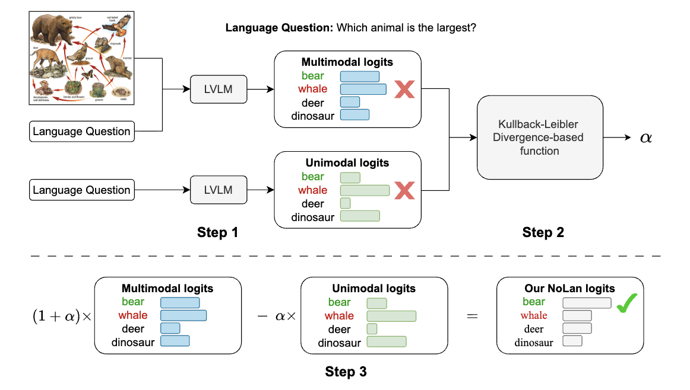
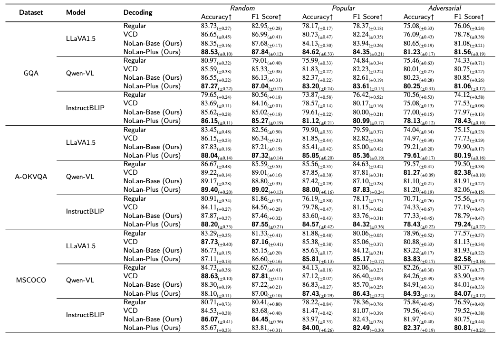
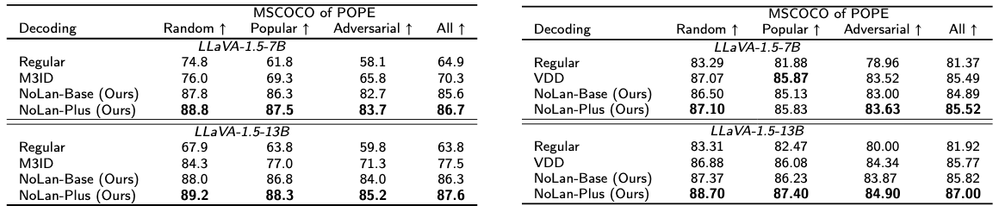
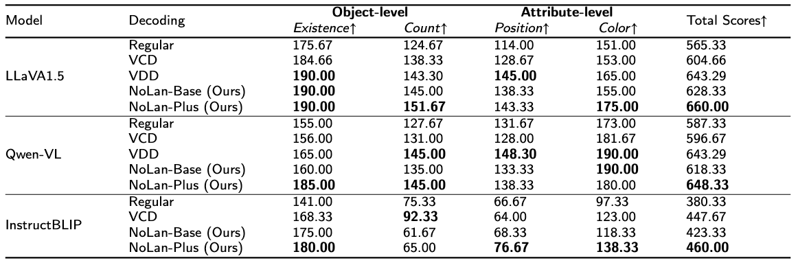
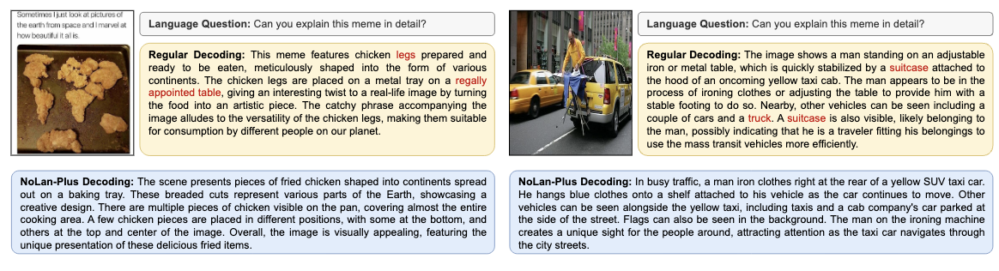
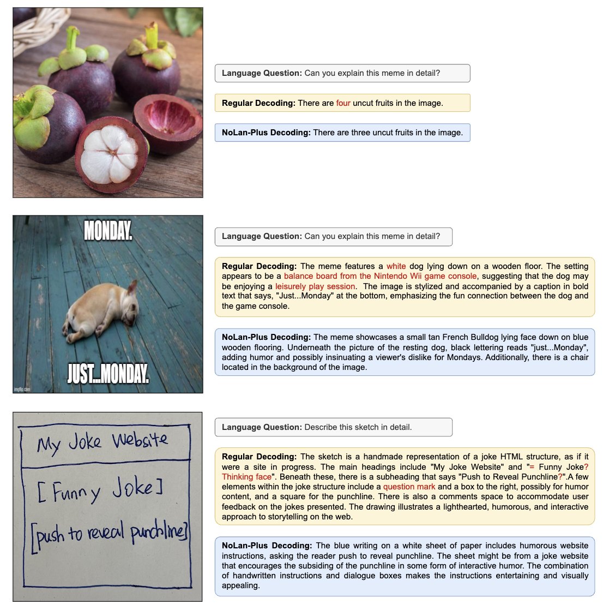
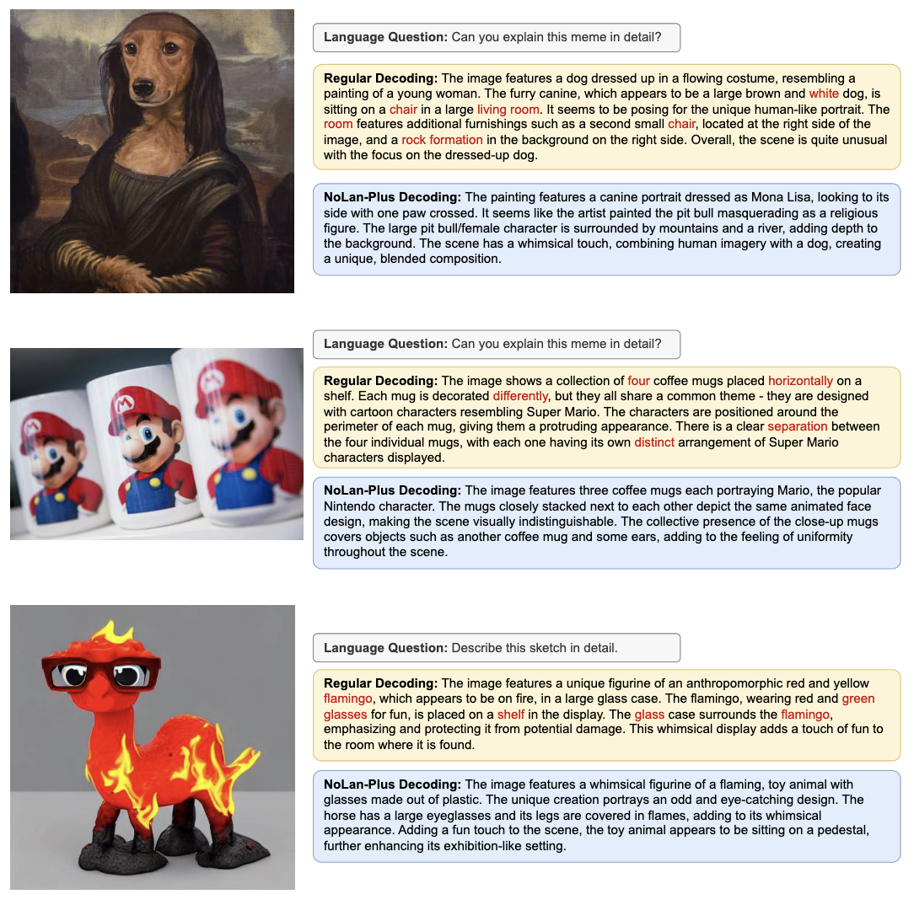

# NoLan: Mitigating Object Hallucinations in Large Vision-Language Models via Dynamic Suppression of Language Priors

This is the official repository for **No-Language-Hallucination Decoding (NoLan)**, a simple, training-free decoding framework designed to mitigate object hallucinations in Large Vision-Language Models (LVLMs) by dynamically suppressing language priors.

<div style='display:flex; gap: 0.25rem; '>
<a href='LICENCE'></a>
<a href='https://arxiv.org/abs/2602.22144'></a>
</div>


## 🔥 Update

* ⭐️ Paper released.
* 🚀 Code released.


## 🎯 Overview



Object hallucination is a critical issue in LVLMs, where models generate objects that do not appear in the image.

Given an LVLM, an image $v$, and a language question $x$, NoLan mitigates hallucinations in responses by comparing outputs generated from multimodal and unimodal (text-only) inputs. Step 2 can also be simplified by setting $\alpha$ to a fixed value of $1$.

NoLan dynamically increases suppression when KL is small, thus restoring visual grounding.

We define:

```math
\gamma = \frac{D_{KL}(l_m \| l_u) + D_{KL}(l_u \| l_m)}{2}
```

```math
\alpha = \beta \times (\tanh(1/\gamma) + 1)
```

This dynamically increases suppression when multimodal and text-only distributions are similar — precisely when hallucination risk is high.


## 🕹️ Usage

### Environment Setup

```bash
conda create -yn nolan python=3.9
conda activate nolan
pip install -r requirements.txt
```


## 🛠 How to Integrate NoLan into LVLMs

NoLan operates during inference and can be seamlessly integrated into autoregressive LVLMs such as:

* LLaVA-1.5
* InstructBLIP
* Qwen-VL

1. Add the following at the beginning of the start-up script:
```python
from nolan_utils.nolan_sample import evolve_nolan_sampling
evolve_nolan_sampling()
```
The `evolve_nolan_sampling` function replaces the sampling function in the transformers library. The modified sampling function includes an option for visual contrastive decoding, while keeping the rest unchanged.

2. Slightly modify `llava_llama.py`:

   a. Add nolan decoding parameters in the `LlavaLlamaForCausalLM` class's `forward` function to avoid exceptions in `model.generate`.
   
   b. Add the `prepare_inputs_for_generation_cd` function.

3. Tokenize multimodal and text-only inputs:
```python
input_ids_cd = tokenizer.encode(prompt_cd, return_tensors="pt").unsqueeze(0).cuda()
input_ids = tokenizer.encode(prompt, return_tensors="pt").unsqueeze(0).cuda()
```

4. Set the hyperparameter in the `generate` function:
```python
output_ids = model.generate(
    input_ids,
    images=image_tensor.unsqueeze(0).half().cuda(),
    input_ids_cd=input_ids_cd,
    cd_alpha=args.cd_alpha,
    cd_beta=args.cd_beta,
    do_sample=True)
```


## 🏅 Experiments

- **The efficacy of NoLan on POPE**



- **The efficacy of NoLan on MME**


- **Please refer to [our paper](https://arxiv.org/abs/2602.22144) for detailed experimental results.**


## 📌 Examples





## 📑 Citation

If you find our project helpful, please consider starring the repository and citing our paper as follows:

```
@article{ren2026nolan,
  author = {Lingfeng Ren, Weihao Yu, Runpeng Yu, Xinchao Wang},
  title = {NoLan: Mitigating Object Hallucinations in Large Vision-Language Models via Dynamic Suppression of Language Priors},
  year = 2026,
  journal = {arXiv preprint arXiv:2602.22144},
  url = {https://arxiv.org/abs/2602.22144}
}
```


## 📝 Related Projects

- [VCD](https://github.com/DAMO-NLP-SG/VCD): Mitigating Object Hallucinations in Large Vision-Language Models through Visual Contrastive Decoding
- [Contrastive Decoding](https://github.com/XiangLi1999/ContrastiveDecoding): Open-ended Text Generation as Optimization
- [InstructBLIP](https://github.com/salesforce/LAVIS/tree/main/projects/instructblip): Towards General-purpose Vision-Language Models with Instruction Tuning
- [Qwen-VL](https://github.com/QwenLM/Qwen-VL): A Versatile Vision-Language Model for Understanding, Localization, Text Reading, and Beyond
- [LLaVA 1.5](https://github.com/haotian-liu/LLaVA): Improved Baselines with Visual Instruction Tuning
Thanks for their awesome works.
